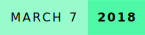
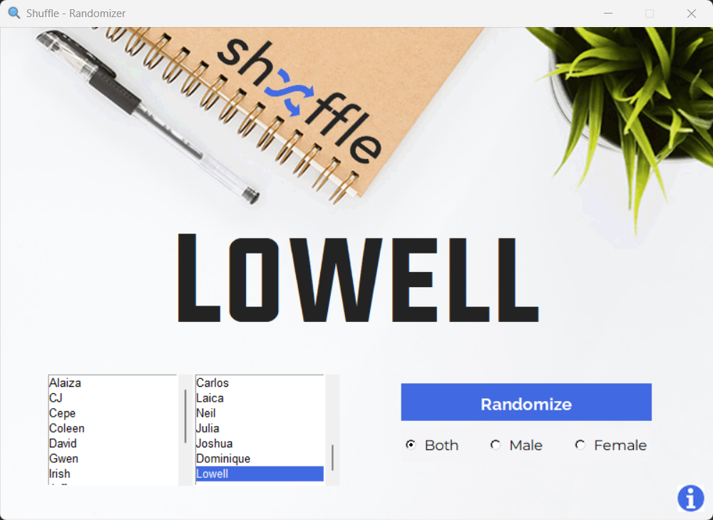
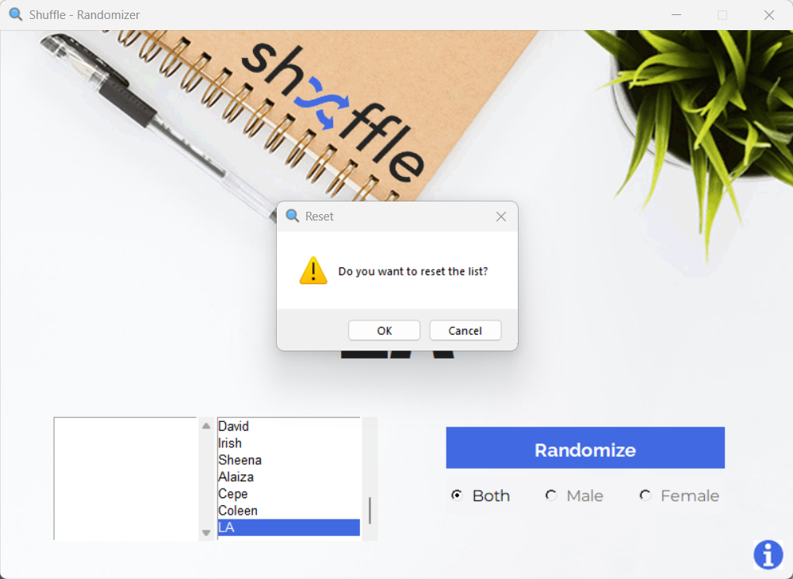

# Shuffle
    

  

Shuffle is a simple, Python-based name randomizer designed to support traditional classroom discussions.

### Author Notes
*I made this when I was in highschool and this was actually used by one of my teachers at that time. This was the time when LLMs weren't really a thing (or at least, not developed enough to be used by the general public), so I had to learn the Tkinter library and consult to StackOverflow when needed lol.*

## Screenshots

    <h3>Main Screen</h3>
    
    <h3>Reset List</h3>
    

## How to Run

You can download the .exe file from the **releases** section of this repository. You can also download the source code and run using `py .\randomizer.pyw`.

## Feedback

If you have any feedback/comment/request, please reach out to [aquino.ylt@gmail.com](mailto:aquino.ylt@gmail.com).
